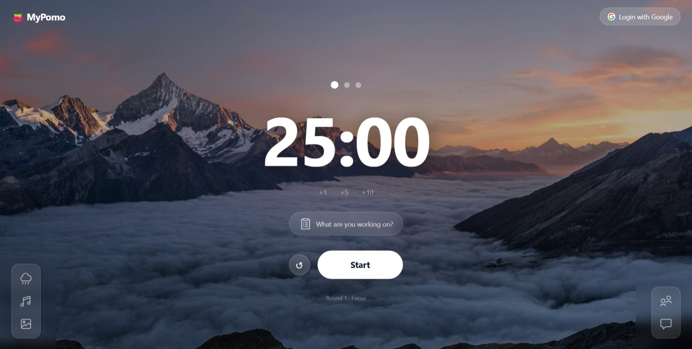

# MyPomo — Pomodoro Focus Timer

A full-stack Pomodoro productivity web app built with **React**, **Node.js/Express**, and **MongoDB**. MyPomo helps you stay focused with a customizable timer, ambient sounds, music player, and beautiful backgrounds — all synced to your account via Google OAuth.



***

## Features

- **Pomodoro Timer** — Classic 25/5/15-minute work and break cycles
- **White Noise Player** — Ambient sounds to boost concentration
- **Music Panel** — Built-in music player for background tracks
- **Background Themes** — Choose from 6 scenic backgrounds (Mountains, Forest, Ocean, City Night, Café, Desert)
- **Google OAuth Login** — Secure sign-in with your Google account
- **Persistent State** — Sessions and settings saved to your account via MongoDB
- **Responsive UI** — Clean, minimal interface with floating dock panels

***

## Tech Stack

| Layer | Technology |
|-------|-----------|
| Frontend | React 19, Vite, Tailwind CSS 4 |
| State Management | Zustand |
| Routing | React Router DOM v7 |
| HTTP Client | Axios |
| Backend | Node.js, Express 5 |
| Database | MongoDB, Mongoose |
| Auth | Passport.js, Google OAuth 2.0, JWT |

***

## Getting Started

### Prerequisites

- Node.js >= 18
- MongoDB instance (local or Atlas)
- Google OAuth credentials ([console.cloud.google.com](https://console.cloud.google.com))

### 1. Clone the repository

```bash
git clone https://github.com/dducbinh/MyPomo.git
cd MyPomo
```

### 2. Set up environment variables

Create a `.env` file in the **root** and **`server/`** directory:

**Root `.env`** (Frontend):
```env
VITE_API_URL=http://localhost:5000
```

**`server/.env`** (Backend):
```env
PORT=5000
MONGODB_URI=your_mongodb_connection_string
JWT_SECRET=your_jwt_secret
GOOGLE_CLIENT_ID=your_google_client_id
GOOGLE_CLIENT_SECRET=your_google_client_secret
CLIENT_URL=http://localhost:5173
```

### 3. Install dependencies

```bash
# Frontend
npm install

# Backend
cd server && npm install
```

### 4. Run the app

```bash
# Start backend (from /server)
cd server && npm run dev

# Start frontend (from root, in a new terminal)
npm run dev
```

The app will be available at `http://localhost:5173`.

***

## Project Structure

```
MyPomo/
├── src/
│   ├── components/       # UI components (Timer, Dock, Panels...)
│   ├── hooks/            # Custom React hooks (useAudioManager, useMusicPlayer...)
│   ├── store/            # Zustand state stores (useAuthStore...)
│   ├── services/         # API service layer (Axios calls)
│   └── App.jsx
├── server/
│   ├── config/           # DB and Passport config
│   ├── models/           # Mongoose schemas
│   ├── routes/           # Express API routes
│   ├── middleware/       # Auth middleware
│   └── index.js
├── public/
└── vite.config.js
```
